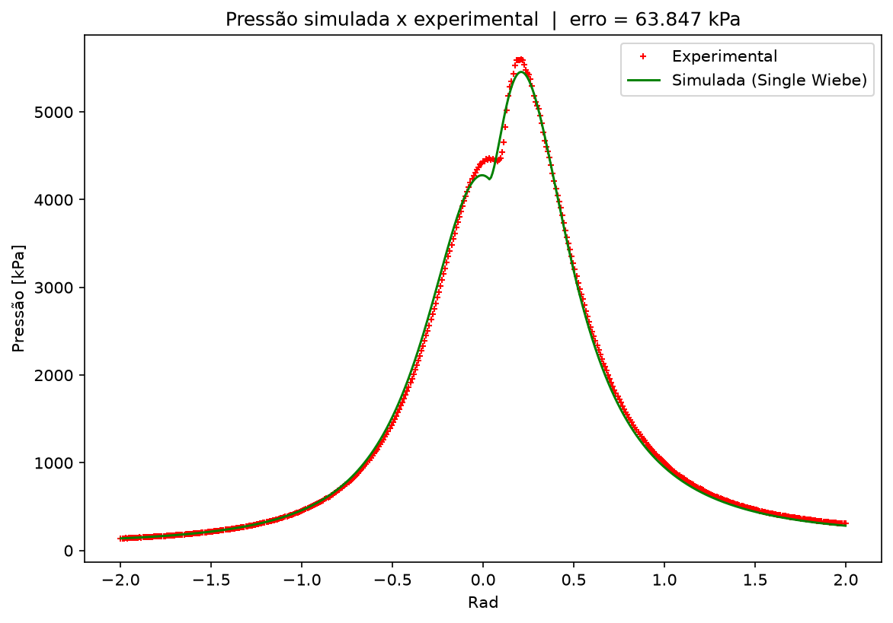

# Modelo Single Wiebe — conversão Python do notebook Mathematica

[](https://www.python.org/)
[](https://numpy.org/)
[](https://scipy.org/)

Conversão, com **alta fidelidade numérica**, do modelo de combustão **Single Wiebe**
implementado originalmente em Wolfram Mathematica
(`Modelo_Single_Wiebe_v1.nb` / `modelo-single-wiebe.pdf`) para Python 3
(NumPy + SciPy + Matplotlib + pandas).

- A função `simulate_model` reproduz **exatamente** a lógica do notebook
  ("modo de compatibilidade");
- Melhorias físicas/numéricas ficam sinalizadas com o marcador `[MELHORIA]`
  em `single_wiebe.py` e **nunca** alteram os resultados por padrão;
- Caso de validação obrigatório reproduzido: erro **409.385649 kPa** vs
  **409.385 kPa** do notebook (Δ ≈ +0.00016 %);
- Calibração reproduzida: PSO (compatível com o original) e
  `differential_evolution` convergem para **≈ 63.8468 kPa**, com ótimo na
  borda do domínio (`theta0 = 2°`, `delta_theta = 40°`), como no Mathematica
  (referência: 63.8473 kPa).

> 📖 **Guia rápido de uso**: abra [`Help.html`](Help.html) no navegador —
> passo a passo de instalação, casos de uso, CLI, troubleshooting e FAQ.
> Este README contém a documentação técnica completa.



*Figura — Pressão simulada (linha verde, Single Wiebe) × experimental
(marcadores "+") em função do ângulo do virabrequim, com os parâmetros
calibrados (PSO/DE, erro = 63.847 kPa). O mesmo estilo do notebook
Mathematica original: `Show[GrafPExp, GrafPSim]`.*

---

## Sumário

1. [Estrutura do projeto](#estrutura-do-projeto)
2. [Instalação](#instalação)
3. [Execução rápida](#execução-rápida)
4. [Interface gráfica (GUI — Streamlit)](#interface-gráfica-gui--streamlit)
5. [Double Wiebe — análise bifásica (extensão)](#double-wiebe--análise-bifásica-extensão)
6. [Dados de entrada](#dados-de-entrada)
7. [Formulação matemática](#formulação-matemática)
8. [Constantes do motor](#constantes-do-motor)
9. [Parâmetros de calibração](#parâmetros-de-calibração)
10. [Sistema de unidades](#sistema-de-unidades)
11. [Método numérico](#método-numérico)
12. [Calibração](#calibração)
13. [Referência da API](#referência-da-api)
14. [Saídas geradas](#saídas-geradas)
15. [Resultados de validação e calibração](#resultados-de-validação-e-calibração)
16. [Particularidades do notebook original](#particularidades-do-notebook-original)
17. [Diferenças Mathematica × SciPy](#diferenças-mathematica--scipy)
18. [Testes](#testes)
19. [Solução de problemas](#solução-de-problemas)
20. [Referências](#referências)

---

## Estrutura do projeto

```
single_wiebe/
├── single_wiebe.py    # biblioteca: dados, geometria, Wiebe, Hohenberg, EDOs, PSO, DE, plots, export
├── run_model.py       # script principal (CLI): valida → calibra → plota → exporta
├── requirements.txt   # dependências
├── README.md          # este documento
├── Help.html          # ajuda de uso (abra no navegador)
├── results/           # gráficos (.png) e tabelas (.csv) gerados
├── tests/
│   └── test_model.py  # 15 testes (geometria, Wiebe, dados, validação 409.385 kPa)
└── combustion_gui/    # interface gráfica (Streamlit) — ver seção abaixo
    ├── app.py         # interface (6 abas), sem equações próprias
    ├── single_wiebe.py  # cópia estendida do modelo (EngineConfig, calibradores com progresso)
    ├── data_processing.py, optimization.py, plotting.py, reporting.py
    ├── requirements.txt, README.md
    ├── sample_data/   # dados de exemplo
    ├── docs/          # figura do README da GUI
    └── tests/         # 25 testes da GUI
```

Arquivo de dados (fica **na pasta pai** do pacote):

```
Larissa/
├── P_exp-Carga-3_45%.txt     # 503 linhas: θ [rad]   P [bar] (sem cabeçalho)
├── Modelo_Single_Wiebe_v1.nb # notebook original (referência)
└── single_wiebe/             # este pacote
```

## Instalação

Requisitos: **Python 3.9+**. Dependências em `requirements.txt`:
`numpy>=1.24`, `scipy>=1.10`, `matplotlib>=3.7`, `pandas>=2.0`, `pytest>=7.0`.

```powershell
# Windows (PowerShell)
cd single_wiebe
python -m venv .venv
.venv\Scripts\activate
pip install -r requirements.txt
```

```bash
# Linux / macOS
cd single_wiebe
python3 -m venv .venv
source .venv/bin/activate
pip install -r requirements.txt
```

Se NumPy/SciPy/Matplotlib/pandas já estiverem instalados globalmente,
o ambiente virtual é opcional.

## Execução rápida

```powershell
python run_model.py                      # fluxo completo (~15 min)
python run_model.py --skip-de            # validação + PSO (~3 min)
python run_model.py --skip-pso           # validação + DE (~13 min)
python run_model.py --skip-pso --skip-de # só validação (~2 s)
```

Opções da linha de comando:

| Opção | Padrão | Descrição |
|-------|--------|-----------|
| `--data CAMINHO` | `..\P_exp-Carga-3_45%.txt` | arquivo experimental (θ [rad], P [bar]) |
| `--seed N` | `42` | semente do PSO e do DE (reprodutibilidade) |
| `--iters N` | `800` | máximo de iterações do PSO |
| `--skip-pso` | — | não executa a calibração PSO |
| `--skip-de` | — | não executa o differential evolution |
| `--outdir PASTA` | `results/` | diretório de saída |
| `--quiet` | — | suprime o log do PSO |

Fluxo executado por `run_model.py`:

1. **Dados** — leitura, filtro −2 ≤ θ ≤ 2 rad, bar → kPa (×100);
2. **Validação** — caso do notebook (`Rc=17, m=0.504, θ₀=−6.54°, Δθ=62°`) → erro 409.385649 kPa;
3. **Calibração** — PSO (modo compatibilidade) e/ou `differential_evolution`;
4. **Saídas** — 9 gráficos + 2 CSVs com o melhor ajuste encontrado.

## Interface gráfica (GUI — Streamlit)

Existe uma **interface gráfica completa** para este modelo, na subpasta
[`combustion_gui/`](combustion_gui/README.md) deste repositório. Ela não
contém equações próprias: chama exatamente as funções validadas de
`single_wiebe.py` (geometria, Wiebe, Hohenberg, EDOs, PSO/DE) através de um
objeto `EngineConfig` configurável.

### O que a GUI oferece

| Aba | Função |
|-----|--------|
| **Experimental Data** | importação `.txt/.csv/.tsv` com separador auto, colunas e unidades configuráveis (ângulo: graus/radianos; pressão: bar/kPa/Pa), filtro de intervalo, ordenação e suavização opcional |
| **Engine Setup** | geometria, operação, combustível e termodinâmica; grandezas derivadas (área do pistão, Vd, Vc, R=l/r, Vp, rev/s) e validação física dos valores |
| **Simulation** | m, θ₀, Δθ (valores do notebook: 0.504 / −6.54° / 62°); integrador, tolerâncias e toggle de perda de calor; indicadores (P máx, T máx, RMSE, R²...) |
| **Calibration** | PSO compatível com o notebook ou `differential_evolution`; seleção de parâmetros livres, limites por parâmetro, refinamento local opcional, progresso ao vivo e cancelamento |
| **Results** | 9 gráficos Plotly interativos (pressão, resíduo, fração queimada, liberação de calor, temperatura, perda, volume, P-V, convergência), rad/graus, kPa/bar e tabela de resíduos |
| **Export** | CSV completo (10 colunas), JSON de parâmetros, PNG/PDF, relatório HTML e histórico da otimização |

### Comandos de execução (comentados)

```powershell
# 1) Entre na pasta da interface gráfica
cd combustion_gui

# 2) Primeira vez: crie o ambiente virtual e instale as dependências
python -m venv .venv                 # cria o ambiente (só na 1ª vez)
.venv\Scripts\activate               # ativa o ambiente (Windows)
# source .venv/bin/activate          # Linux/macOS
pip install -r requirements.txt      # streamlit, plotly, numpy, scipy, pandas, matplotlib

# 3) Inicie a interface — o navegador abre em http://localhost:8501
streamlit run app.py
```

Em uma linha (após instalar as dependências):

```powershell
cd combustion_gui ; streamlit run app.py
```

> **Dica:** para testar a GUI, carregue na aba *Experimental Data* o arquivo
> `sample_data\P_exp-Carga-3_45%.txt` (fornecido com a GUI) — com o filtro
> −2 ≤ θ ≤ 2 rad devem restar **459 observações**, igual à análise do
> notebook. A calibração roda em thread separada com barra de progresso e
> pode ser cancelada a qualquer momento sem perder resultados anteriores.

Detalhes completos (telas, integração GUI ↔ modelo, tratamento de erros)
estão em [`combustion_gui/README.md`](combustion_gui/README.md).

## Double Wiebe — análise bifásica (extensão)

O **Double Wiebe Combustion Analysis** é a extensão bifásica deste projeto:
duas funções de Wiebe (fase 1 pré-misturada, fase 2 controlada por difusão)
ponderadas por `alpha`, acopladas ao mesmo modelo termodinâmico de zona única
com transferência de calor de Hohenberg. É um pacote instalável, com CLI
própria (`double-wiebe`) e GUI Streamlit, em `../double_wiebe/` (pasta irmã
deste repositório).

> *This combustion simulation employs a double Wiebe function and extends
> the single Wiebe model developed as part of L. Queiroz's M.Sc. thesis
> under the supervision of Prof. I. L. Ferreira.*

Com `alpha = 1` (ou 0) e fases idênticas, o Double Wiebe reduz-se exatamente
à Single Wiebe — propriedade verificada analiticamente em
`double_wiebe/tests/test_wiebe.py` —, o que torna os dois modelos comparáveis
diretamente sobre o mesmo experimento.

### Como iniciar uma análise de Double Wiebe

```bash
cd ../double_wiebe
pip install -e .                # instala o pacote e o comando `double-wiebe`
double-wiebe --help             # verificação rápida
```

1. **Dados experimentais** — arquivo texto com duas colunas numéricas
   (ângulo, pressão); ângulo em radianos ou graus, pressão em Pa/kPa/bar.
   Exemplo incluído: `data/example_pressure.txt` (θ em rad, P em bar).
2. **Configuração** — gere um YAML comentado e edite as seções `data`,
   `engine`, `wiebe`, `simulation` e `calibration` (ângulos em graus no
   YAML; internamente em radianos):

   ```bash
   double-wiebe example-config configs/meu_config.yaml
   ```

3. **Simular** (sobrescritas rápidas com `--set`, repetíveis):

   ```bash
   double-wiebe simulate --data data/example_pressure.txt        --config configs/example.yaml --output outputs/run_01
   # exemplo de sobrescrita:
   double-wiebe simulate --data data/exemplo.txt        --set wiebe.alpha=0.4 --set engine.Rc=17.0 --output outputs/run_02
   ```

4. **Calibrar** (busca global + refinamento least-squares + sensibilidade):

   ```bash
   double-wiebe calibrate --data data/example_pressure.txt        --config configs/example.yaml        --method differential-evolution --seed 42        --select theta01,delta1,alpha --output outputs/calib_01
   ```

   Métodos: `differential-evolution`, `pso`, `least-squares`.
   Códigos de saída: 0 ok · 1 falha de execução · 2 entrada inválida.
   **Não calibre os 10 parâmetros de uma vez** — comece com 2–4
   parâmetros identificados e observe os alertas de
   identificabilidade/bordas.

5. **Interface gráfica** (7 abas; mesmo núcleo da CLI):

   ```bash
   double-wiebe gui
   ```

6. **Exportações** por execução: `results.csv` (14 colunas),
   `parameters.yaml`, `metrics.json`, `convergence.csv`,
   `pressure_comparison.png/.pdf`, `heat_release.png`,
   `burned_fraction.png` e `report.html` (autocontido).

Documentação completa (modelo, unidades, limitações, testes):
`double_wiebe/README.md`.

## Dados de entrada

`P_exp-Carga-3_45%.txt` — 2 colunas separadas por espaço/tabulação, sem
cabeçalho: **ângulo do virabrequim [rad]** e **pressão no cilindro [bar]**.

Preparo (idêntico ao `extrairIntervalo` do notebook):

1. leitura das linhas válidas (503 observações);
2. filtro **−2 ≤ θ ≤ 2 rad** → **459 pontos** (a ordem do arquivo é mantida);
3. conversão bar → kPa (**× 100**);
4. ordenação por ângulo (o arquivo já está crescente; o `Select` do
   Mathematica também preserva a ordem);
5. `theta_i = −1.998401994 rad`, `theta_f = +1.998401994 rad`,
   `P1 = 138.2 kPa` (pressão no IVC), passo 0.008726646 rad (0.5°);
6. `T1 = 273.15 + 35 = 308.15 K`, `V1 = V(theta_i)`.

`load_experimental` valida 503/459 e levanta `ValueError` se divergir.

## Formulação matemática

### Geometria biela-manivela

Deslocamento do pistão (a partir do PMS, θ = 0):

```
y(θ) = r·[1 − cos θ + (1/R)·(1 − sqrt(R² − sin²θ))]     r = s/2,  R = l/r
```

Volume instantâneo:

```
V(θ) = Vc + (Vd/2)·[R + 1 − cos θ − sqrt(R² − sin²θ)]
Vc = Vd/(Rc − 1)        Vd = A_cil·s        A_cil = π·(d/2)²
```

Derivada e área de transferência de calor:

```
dV/dθ = (Vd/2)·[sin θ + (sin θ·cos θ)/sqrt(R² − sin²θ)]
As(θ) = 2·(π·d²/4)·(1/R)·(1 − sqrt(R² − sin²θ)) + π·d·y(θ) + π·d²/4
```

### Combustão — Single Wiebe (modo compatibilidade)

```
x_b(θ) = 1 − exp[−a·z^(m+1)],   z = (θ − θ0)/Δθ   (θ ≥ θ0; 0 caso contrário)
dx_b/dθ = (a·(m+1)/Δθ)·z^m·exp[−a·z^(m+1)]
```

com `a = 6.9078` (→ `x_b ≈ 0.999` em `z = 1`). **Não há truncamento** em
`θ0 + Δθ` — a cauda assintótica segue ativa, como no Mathematica
(veja [Particularidades](#particularidades-do-notebook-original)).

Calor liberado:

```
dQ/dθ = m_comb · PCI · dx_b/dθ      [kJ/rad]
```

### Perda de calor — Hohenberg

```
h = 130 · V^(−0.06) · (P·10⁻²)^0.8 · Tg^(−0.4) · (Vp + 1.4)^0.8   [W/(m²·K)]
```

com **P em kPa** (o fator `10⁻²` converte para a escala bar da correlação),
`Vp = 2·s·omega` (velocidade média do pistão, **omega em rotações/segundo**) e

```
dQp/dθ = h · As · (Tg − Tw) / (2·π·omega)     [J/rad]
```

### Sistema de EDOs (estado Y = [P, Tg, Qp], integrado em θ)

```
dP/dθ   = (1/V) · [ (κ − 1)·(dQ/dθ − dQp/dθ/1000) − κ·P·dV/dθ ]      [kPa/rad]
dTg/dθ  = (T1/(P1·V1)) · ( V·dP/dθ + P·dV/dθ )                        [K/rad]
dQp/dθ  = h·As·(Tg − Tw)/(2·π·omega)                                  [J/rad]
```

Condições iniciais em `theta_i`: `P = P1` (kPa), `Tg = T1` (K), `Qp = 0` (J).

Função objetivo (definição **exata** do notebook):

```
erro = sqrt( SSres / (q − 2) ),   q = nº de pontos experimentais
```

## Constantes do motor

| Constante | Valor | Descrição |
|-----------|-------|-----------|
| `D_BORE` (d) | 86/1000 m | diâmetro do cilindro |
| `S_STROKE` (s) | 70/1000 m | curso |
| `L_ROD` (l) | 117.5/1000 m | comprimento da biela |
| `R_CRANK` (r) | s/2 | raio da manivela |
| `R_ROD_RATIO` (R) | l/r | razão biela/manivela |
| `KAPPA` (κ) | 1.37 | razão de capacidades caloríficas |
| `RPM` | 3396.20 | rotação |
| `OMEGA_REV_S` | RPM/60 | **rotações por segundo** (não rad/s!) |
| `M_COMB` | 9.42754647351e-6 kg | massa de combustível por ciclo |
| `PCI` | 39191.3 kJ/kg | poder calorífico inferior |
| `A_WIEBE` | 6.9078 | parâmetro de eficiência do Wiebe |
| `TW` | 440 K | temperatura da parede |
| `T1` | 308.15 K | temperatura no IVC |
| `RTOL/ATOL` | 1e-9 | tolerâncias do `solve_ivp` |
| `PENALTY` | 1e10 | objetivo em caso de falha da integração |

## Parâmetros de calibração

| Parâmetro | Significado físico | Unidade | Limites |
|-----------|--------------------|---------|---------|
| `Rc` | razão de compressão (Vmax/Vc) | – | 15 – 17 |
| `m` | expoente de forma do Wiebe (pico da taxa de queima) | – | 0.1 – 1.0 |
| `theta0` | início da combustão | rad (limites em graus: −1° a 2°) | −0.01745 – 0.03491 |
| `delta_theta` | duração característica da combustão | rad (limites em graus: 40° a 60°) | 0.69813 – 1.04720 |

## Sistema de unidades

| Grandeza | Unidade |
|----------|---------|
| ângulo `theta` | **rad** (cálculos e gráficos; CSVs trazem também graus) |
| pressão `P` | kPa (dados entram em bar, ×100) |
| temperaturas `Tg, T1, Tw` | K |
| volumes `V, Vc, Vd` | m³ |
| `dQ/dθ` | kJ/rad |
| calor perdido `Qp` | J |
| coeficiente de película `h` | W/(m²·K) |
| `omega` | **rotações/segundo**; `2·π·omega` converte W → J/rad na perda de calor |

⚠ **Não altere essas escalas** — o modo de compatibilidade depende delas
(p. ex., o ÷1000 que converte `dQp` de J/rad para kJ/rad dentro da equação
de `dP/dθ`).

## Método numérico

- Integração com `scipy.integrate.solve_ivp`, método **DOP853**
  (Runge–Kutta 8(5,3)), `rtol = atol = 1e-9`;
- `t_eval` recebe diretamente os ângulos experimentais — **sem
  interpolação** (equivalente numérico da avaliação do interpolante do
  NDSolve nos mesmos pontos);
- RHS implementado como função pura de θ e Y (sem globais); derivadas
  geométricas fechadas (sem diferenças finitas);
- **Proteção de otimização**: se alguma derivada ficar não finita ou o
  estado ultrapassar o limite de sanidade `|Y| > 1e12`, a RHS lança
  `_ModelBlowUp` e `simulate_model` retorna a **penalidade**
  `(PENALTY, None, None, None)` sem interromper o PSO/DE;
- `np.errstate(divide="ignore", invalid="ignore")` suprime apenas os
  RuntimeWarnings benignos dos caminhos de penalidade (0⁰, potências de
  valores inválidos já descartados).

## Calibração

### PSO — modo de compatibilidade (`calibrate_pso`)

Replica o PSO do notebook:

- 20 partículas, `beta = 2`, `max_iteracoes = 800`, `max_repeticoes = 10`,
  `tolerancia = 1e-10`;
- **sem** termo de velocidade/inércia; atualização por componente:

  ```
  x ← x + β·r1·(pbest − x) + β·r2·(gbest − x),   r1, r2 ~ U(0,1)
  ```

- limites aplicados por *clamp* após cada atualização;
- parada por estagnação: 10 iterações consecutivas com deslocamento
  max-norma do global best ≤ 1e-10, ou ao esgotar 800 iterações;
- semente controlável (`--seed` / parâmetro `seed`) para reprodutibilidade.

### Differential evolution — alternativa (`calibrate_de`)

`scipy.optimize.differential_evolution` com os mesmos limites,
`polish=False`, tolerância 1e-10 — verificação independente do ótimo do PSO.
Com seed 42 encontrou erro 63.846770 kPa (vs 63.846776 do PSO).

**Ótimo na borda do domínio**: ambos convergem para
`theta0 = 2°` e `delta_theta = 40°` (limites superiores/inferiores), como no
notebook original. Isso indica que o modelo, dentro dessa parametrização,
preferiria um início de combustão ainda mais tardio e uma queima mais curta —
a borda ativa deve ser interpretada na análise física dos resultados.

## Referência da API

Módulo: `single_wiebe.py`

| Função / classe | Assinatura | Descrição |
|-----------------|------------|-----------|
| `load_experimental` | `(path) → dict` | leitura + filtro + conversão; chaves: `theta`, `pressure`, `n_total`, `n_filtered`, `P1`, `theta_i`, `theta_f` |
| `piston_disp` | `(theta, Rc) → float/array` | deslocamento do pistão `y(θ)` |
| `cylinder_volume` | `(theta, Rc) → float/array` | volume instantâneo `V(θ)` |
| `dV_dtheta` | `(theta, Rc) → float/array` | derivada do volume |
| `heat_area` | `(theta, Rc) → float/array` | área de transferência de calor `As(θ)` |
| `burned_fraction` | `(theta, theta0, delta_theta, m) → (x, dx)` | Wiebe e derivada (modo compatibilidade, com guarda `θ ≥ θ0`) |
| `wiebe_truncated` | idem | **[MELHORIA]** Wiebe com corte em `θ0 + Δθ` |
| `heat_release` | `(theta, theta0, delta_theta, m) → dQ/dθ` | taxa de liberação [kJ/rad] |
| `hohenberg_h` | `(theta, P_kPa, Tg, Rc) → h` | coeficiente de película [W/(m²·K)] |
| `simulate_model` | `(Rc, m, theta0, delta_theta, theta_exp, pressure_exp, rtol=1e-9, atol=1e-9, method="DOP853") → (erro, P_sim, Tg_sim, Qp_sim)` | simulação + erro; falha → `(1e10, None, None, None)` |
| `simulate_full` | idem → `ModelResult` | resultado completo (inclui `x_b`, `dQ_dtheta`) para plots/export |
| `compute_error` | `(P_exp, P_sim) → float` | `sqrt(SSres/(q−2))` — definição do notebook |
| `calibrate_pso` | `(theta_exp, pressure_exp, n_particulas=20, beta=2.0, max_iteracoes=800, max_repeticoes=10, tolerancia=1e-10, seed=None, verbose=True) → dict` | PSO compatível; chaves: `params`, `erro`, `iteracoes`, `history`, `history_params`, `parou_por_repeticao` |
| `calibrate_de` | `(theta_exp, pressure_exp, seed=None, maxiter=300, popsize=20, tol=1e-10, polish=False) → dict` | DE alternativo; chaves análogas |
| `make_plots` | `(res, calibration=None, outdir="results", data=None)` | gera os 9 PNGs (4 replicam as figuras do notebook/PDF; `data` = dicionário de `load_experimental`, inclui a figura dos dados brutos) |
| `export_csv` | `(res, outdir="results")` | escreve `resultados_simulacao.csv` |
| `export_pressure_degrees_bar` | `(Rc, m, theta0, delta_theta, theta_i, theta_f, P1, outdir, step_deg=0.34)` | re-integra na grade de graus → `pressao_simulada_graus_bar.csv` |

### Exemplos de uso

**Validação programática:**

```python
import numpy as np
import single_wiebe as sw

data = sw.load_experimental("../P_exp-Carga-3_45%.txt")
erro, P_sim, Tg_sim, Qp_sim = sw.simulate_model(
    Rc=17.0, m=0.504,
    theta0=np.radians(-6.54), delta_theta=np.radians(62.0),
    theta_exp=data["theta"], pressure_exp=data["pressure"],
)
print(f"erro = {erro:.6f} kPa")   # 409.385649
```

**Simulação completa + gráficos + exportação:**

```python
res = sw.simulate_full(16.0, 0.55, np.radians(0.0), np.radians(50.0),
                       data["theta"], data["pressure"])
print(f"erro = {res.erro:.4f} kPa | P_sim max = {res.P_sim.max():.1f} kPa")
print(f"x_b final = {res.x_b[-1]:.4f}")
sw.make_plots(res, outdir="results")
sw.export_csv(res, outdir="results")
```

**Calibração direta (sem o script):**

```python
pso = sw.calibrate_pso(data["theta"], data["pressure"], seed=42, verbose=False)
print(pso["params"], pso["erro"])        # array([Rc, m, theta0, delta_theta]) em rad
print(pso["parou_por_repeticao"])        # True -> parou por estagnação

de = sw.calibrate_de(data["theta"], data["pressure"], seed=42)
print(de["params"], de["erro"])
```

**Varredura de sementes:**

```python
resultados = []
for s in range(1, 6):
    r = sw.calibrate_pso(data["theta"], data["pressure"], seed=s, verbose=False)
    resultados.append((s, r["erro"], r["params"]))
    print(f"seed {s}: erro = {r['erro']:.4f} kPa")
```

## Saídas geradas

### Gráficos (`results/`, backend Agg, eixos de ângulo em **rad**)

As **quatro primeiras figuras replicam os gráficos do notebook/PDF**
(`GrafPall`, `GrafPbar`, `GrafPExp` e `Show[GrafPExp, GrafPSim]`), no mesmo
estilo: pontos experimentais como marcadores **"+" vermelhos** e curva
simulada como **linha verde contínua**:

1. `01_pressao_exp_bruta_kpa_rad.png` — **GrafPall**: todos os 503 pontos
   brutos do arquivo (kPa × rad). No notebook a curva era plotada em bar
   com rótulo "kPa"; aqui os valores são convertidos e o rótulo é coerente;
2. `02_pressao_exp_filtrada_bar_rad.png` — **GrafPbar**: dados filtrados
   (−2 ≤ θ ≤ 2), em bar;
3. `03_pressao_exp_filtrada_kpa_rad.png` — **GrafPExp**: dados filtrados
   em kPa;
4. `04_pressao_exp_sim_kpa_rad.png` — **Show[GrafPExp, GrafPSim]**:
   experimental ("+") × simulada (linha verde), com o erro no título;
5. `05_fracao_queimada.png` — fração queimada `x_b`;
6. `06_dQ_dtheta_kJ_rad.png` — **GrafdQdθ**: taxa de liberação de calor
   (kJ/rad), linha verde como no original;
7. `07_temperatura_gas.png` — temperatura do gás (K);
8. `08_calor_perdido.png` — calor perdido acumulado (Hohenberg);
9. `09_convergencia.png` — convergência da função objetivo.

> **Rotulagem corrigida**: os cálculos são todos em radianos; algumas figuras
> do notebook original diziam "graus" por engano (p. ex. o rótulo
> "dQdθ [kJ/deg]", embora a grandeza seja kJ/rad) — aqui os eixos dizem rad.

### Tabelas

**`resultados_simulacao.csv`** — separador `;`, 459 linhas, colunas:

```
theta_rad; theta_deg; pressure_exp_kPa; pressure_sim_kPa;
temperature_K; heat_loss_J; burned_fraction; dQ_dtheta_kJ_per_rad
```

**`pressao_simulada_graus_bar.csv`** — pressão simulada em graus e bar com
passo ≈ 0.34° (equivalente à exportação original do notebook), obtida por
re-integração com `t_eval` na grade de graus (sem interpolação).

> **Nota física**: `heat_loss_J` pode ser levemente **negativo** no início —
> com `Tg (≈308 K) < Tw (440 K)` no IVC, o fluxo inicial é das paredes para o
> gás. Comportamento fiel ao modelo original.

## Resultados de validação e calibração

### Validação (caso obrigatório do notebook)

| | Mathematica | Python |
|---|---|---|
| Parâmetros | Rc=17, m=0.504, θ₀=−6.54°, Δθ=62° | idem |
| erro | 409.385 kPa | **409.385649 kPa** |
| diferença | — | +0.000649 kPa (+0.00016 %) |

### Calibração (seed 42)

| Método | erro (kPa) | Rc | m | θ₀ | Δθ | Observação |
|--------|-----------:|------:|--------:|-----:|-----:|------------|
| PSO (compat.) | 63.846776 | 15.869377 | 0.524691 | 2.0000° | 40.0000° | 153 iterações, parou por estagnação |
| DE (SciPy) | 63.846770 | 15.869301 | 0.524679 | 2.0000° | 40.0000° | 300 iterações |
| Referência Mathematica | 63.8473 | 15.8686 | 0.524544 | 2.0000° | 40.0000° | PSO sem semente (estocástico) |

O PSO é estocástico: não exija parâmetros idênticos a cada execução —
verifique o **valor do erro**, que converge para ≈ 63.85 kPa. Ambos os
métodos atacam a **borda do domínio** em `theta0` e `delta_theta`, como o
original (discussão na seção [Calibração](#calibração)).

## Particularidades do notebook original

Preservadas no modo de compatibilidade, cada uma com comentário no código:

1. **Divisor `q − 2`** — `erro = sqrt(SSres/(q−2))` embora **quatro**
   parâmetros sejam ajustados. É a definição exata do notebook
   (`Sqrt[SSres/(q - 2.)]`); estatisticamente o divisor "correto" seria
   `q − 4` (diferência ≈ 0.5 % nos erros). Mantido para reproduzir os
   valores de referência.
2. **Wiebe sem truncamento** — `x_b` não é limitado em `θ0 + Δθ`; a cauda
   assintótica segue contribuindo para a liberação de calor. Versão
   truncada disponível como melhoria: `sw.wiebe_truncated`.
3. **`omega` em rotações/segundo** — `Vp = 2·s·omega` e o denominador
   `2·π·omega` usam rev/s, exatamente como o original (o fator `2π`
   embutido converte W → J/rad).
4. **Hohenberg com P em kPa** — o fator `(P·10⁻²)^0.8` converte kPa → bar
   dentro da correlação.
5. **Guarda do Wiebe** — a expressão bruta de `x(θ)` avaliada antes de `θ0`
   geraria valores complexos no Mathematica; os *guards* existiam apenas em
   `dxdθ` e `Q`. Em Python a guarda está centralizada em `burned_fraction`
   (`active = theta >= theta0`, com `z_safe = max(z, 0)`), e `0⁰ = 1`
   coincide com a convenção do Mathematica.

### Inconsistências encontradas no notebook

- **Rotulagem de eixos**: figuras com ângulo em graus embora os cálculos
  sejam em radianos (corrigido nos gráficos Python);
- **Divisor `q − 2`** inconsistente com os 4 parâmetros ajustados;
- **Wiebe sem corte em `Δθ`**: a fração queimada ultrapassa o intervalo
  nominal da combustão;
- **PSO sem inércia** com contadores de repetição reiniciados a cada
  movimento do global best: convergência dependente de sorte; o DE
  alternativo confirma o mesmo ótimo com maior robustez.

## Diferenças Mathematica × SciPy

| Item | Mathematica | Python |
|------|-------------|--------|
| integrador | `NDSolve` (método automático, `MaxSteps → 10⁶`) | `solve_ivp` **DOP853**, `rtol=atol=1e-9` |
| avaliação nos pontos | interpolante do NDSolve | `t_eval` nativo (sem interpolação) |
| validação (erro) | 409.385 kPa | 409.385649 kPa |
| calibração | PSO estocástico sem semente | PSO com `--seed` + DE de verificação |
| falha de integração | trava/avaliação complexa | exceção `_ModelBlowUp` → penalidade 1e10 |

## Testes

```powershell
python -m pytest tests/ -v      # recomendado
python tests/test_model.py      # alternativa sem pytest
```

15 testes: leitura de 503/459 pontos, geometria (V no PMS/PMI, extremos do
pistão, `dV/dθ` analítica × numérica, área em θ=0), Wiebe (zero antes de
`θ0`, início em zero, derivada × numérica, não-truncamento), dimensões e
NaN das saídas, condições iniciais, **caso de validação 409.385 kPa**
(tolerância 0.1 kPa) e **penalidade** para parâmetros não físicos
(sem exceção escapando para o otimizador).

## Solução de problemas

| Sintoma | Causa provável | Solução |
|---------|----------------|---------|
| `ValueError: Esperadas 503 observações…` | arquivo de dados errado/modificado | conferir `--data`; usar o arquivo original |
| Validação ≠ 409.385 kPa | tolerâncias/dados alterados | conferir `RTOL_DEFAULT`/`ATOL_DEFAULT` e o arquivo de dados |
| PSO lento (> 5 min) | 800 it × 20 partículas × ~459 pontos | normal; costuma parar antes (~150 it). Reduza com `--iters 300` |
| `erro = 10000000000.0` | penalidade (integração falhou) | esperado para parâmetros não físicos; a otimização continua |
| `ModuleNotFoundError: single_wiebe` | executando de fora da pasta | `cd single_wiebe` ou ajuste o `PYTHONPATH` |
| Acentos estranhos no console | codepage do Windows | `$env:PYTHONIOENCODING="utf-8"` (PowerShell) |
| Matplotlib não abre janelas | backend `Agg` por design | abra os PNGs em `results/` |

Mais detalhes práticos em [`Help.html`](Help.html).

## Referências

- Notebook original: `Modelo_Single_Wiebe_v1.nb` (pasta pai deste pacote);
- Documento: `modelo-single-wiebe.pdf`;
- Correlação de perda de calor: **Hohenberg** — correlação adaptada
  `h = 130·V^(−0.06)·(P·10⁻²)^0.8·Tg^(−0.4)·(Vp + 1.4)^0.8`;
- Função de combustão: **Wiebe** (função exponencial single-Vibe), com
  eficiência `a = 6.9078` (`1 − e^(−6.9078) ≈ 0.999`);
- Integrador: Hairer, Nørsett & Wanner — **DOP853** (Runge–Kutta 8(5,3)),
  implementado em `scipy.integrate.solve_ivp`.