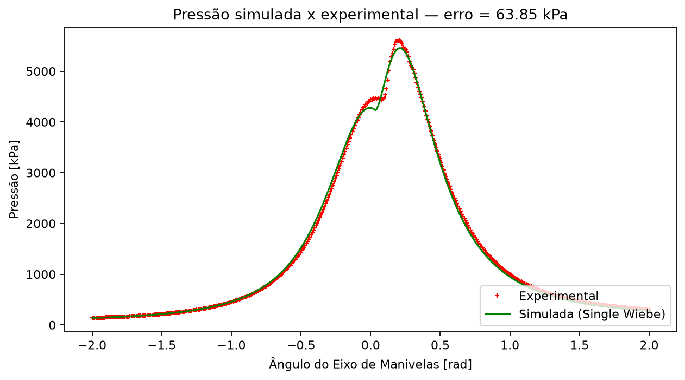

# Single Wiebe Combustion Analysis — GUI (Streamlit)

Interface gráfica para análise de combustão em motores de combustão interna
interna com o modelo **Single Wiebe**. Desenvolvida como ferramenta
complementar à conversão Python do notebook Mathematica
(`Modelo_Single_Wiebe_v1.nb`), parte da dissertação de mestrado de
**L. Queiroz** sob orientação do **Prof. I. L. Ferreira**.



---

## Instalação

Requisitos: **Python 3.11+** e **Git**.

```bash
# 1) Clonar o repositório (a GUI fica na subpasta combustion_gui/)
git clone https://github.com/ileaof/combustionpy-single-wiebe.git
cd combustionpy-single-wiebe/combustion_gui

# 2) Criar e ativar o ambiente virtual (.venv) — antes de instalar, só na 1ª vez
python -m venv .venv            # Linux/macOS: python3 -m venv .venv
# Windows:
.venv\Scripts\activate
# Linux/macOS:
source .venv/bin/activate

# 3) Instalar as dependências (com o .venv ativo)
python -m pip install --upgrade pip
pip install -r requirements.txt
```

Sem Git: no GitHub, use *Code → Download ZIP* e extraia. Com o ambiente
ativo, o prompt exibe `(.venv)`; em cada terminal novo basta ativá-lo de
novo (sem recriar). Se o PowerShell recusar a ativação (*"a execução de
scripts foi desabilitada"*), rode uma vez
`Set-ExecutionPolicy -Scope CurrentUser RemoteSigned`. Se você já criou o
`.venv` na raiz do repositório (README principal), pode usá-lo: ative-o e
rode só o `pip install -r requirements.txt` desta pasta.

**GPU NVIDIA (opcional)** — para o modo acelerado por CUDA na calibração:

```bash
pip install cupy-cuda12x      # requer placa NVIDIA + driver recente
```

Sem CuPy (ou sem GPU) a GUI funciona normalmente; a opção GPU apenas não
aparece. Ver [Aceleração por GPU](#aceleração-por-gpu-cuda).

## Execução

```bash
streamlit run app.py
```

O navegador abre automaticamente em `http://localhost:8501`.
Dados de exemplo já inclusos em `sample_data/P_exp-Carga-3_45%.txt`
(2 colunas sem cabeçalho: ângulo [rad], pressão [bar]; 503 observações,
das quais 459 no intervalo −2 ≤ θ ≤ 2 rad).

---

## Estrutura

```text
combustion_gui/
├── app.py               # interface Streamlit (6 abas)
├── single_wiebe.py      # modelo científico (física, EDOs, calibradores)
├── data_processing.py   # leitura flexível, conversões, validações
├── optimization.py      # orquestração da calibração (seleção/limites/polish/backend)
├── gpu_backend.py       # modo acelerado: RK4 em lote NumPy e CUDA (CuPy, opcional)
├── plotting.py          # gráficos Plotly (interativos) e Matplotlib (estáticos)
├── reporting.py         # CSV, JSON, relatório HTML, histórico
├── requirements.txt
├── README.md
├── sample_data/         # dados experimentais de exemplo
└── tests/               # pytest
```

**Separação de responsabilidades**: a interface (`app.py`) não contém
nenhuma equação — toda a física (geometria biela-manivela, função de Wiebe,
correlação de Hohenberg, sistema de 3 EDOs, PSO/DE) vive em
`single_wiebe.py`, que expõe as mesmas funções validadas contra o notebook
original (validação 409.385 kPa reproduzida).

## Telas

1. **Experimental Data** — upload `.txt/.csv/.tsv` com separador auto/fixo,
   escolha de colunas e unidades (ângulo: graus/radianos; pressão:
   bar/kPa/Pa), filtro de intervalo, ordenação e suavização opcional
   (Savitzky-Golay, desativada). Métricas do conjunto, prévia da tabela e
   gráfico interativo.
2. **Engine Setup** — geometria, operação, combustível e propriedades
   termodinâmicas em 4 grupos; grandezas derivadas calculadas
   (área do pistão, Vd, volume de folga, R=l/r, Vp, rev/s); validação
   física dos valores.
3. **Simulation** — m, θ₀ e Δθ com valores iniciais do notebook
   (0.504 / −6.54° / 62°); opções avançadas (integrador, rtol/atol,
   transferência de calor); botão *Run simulation*; 8 indicadores
   (P máx, T máx, x_b final, calores, RMSE, R², erro do notebook).
4. **Calibration** — seleção dos parâmetros livres (Rc, m, θ₀, Δθ), limites
   por parâmetro (padrão do notebook), PSO compatível com o original ou
   differential_evolution, refinamento local opcional (L-BFGS-B),
   progresso ao vivo (iteração, melhor erro, parâmetros, tempo) e botão de
   cancelamento; tabela inicial × calibrado com alertas de ótimo na borda.
   Expander **Desempenho (CPU / GPU)**: backend (referência, GPU CUDA ou
   RK4 em lote na CPU), precisão e sub-passos do modo acelerado.
5. **Results** — 9 gráficos Plotly (pressão, resíduo, fração queimada,
   liberação de calor, temperatura, perda, volume, P-V, convergência);
   alternância rad/graus e kPa/bar; tabela de resíduos com percentual.
6. **Export** — CSV completo (10 colunas), JSON de parâmetros, PNG/PDF dos
   gráficos, relatório HTML autocontido e histórico da otimização.

## Integração GUI ↔ modelo

```text
app.py (Streamlit)
   ├── data_processing.py ──> numpy arrays (theta [rad], P [kPa])
   ├── optimization.py    ──> single_wiebe.calibrate_pso_bounds / calibrate_de_bounds
   ├── plotting.py        ──> lê ModelResult + single_wiebe.cylinder_volume
   └── reporting.py       ──> lê ModelResult + single_wiebe.cylinder_volume
                └──────────────> single_wiebe.simulate_full(cfg=EngineConfig)
```

- `EngineConfig` carrega geometria/propriedades editadas na GUI para dentro
  das funções físicas **sem duplicar equações** (default = modo de
  compatibilidade do notebook);
- a simulação avalia a solução exatamente nos ângulos experimentais
  (`t_eval`), sem interpolação;
- falhas de integração retornam penalidade alta (`1e10`) sem interromper a
  otimização nem derrubar a aplicação;
- a calibração roda em **thread separada** com progresso compartilhado e
  cancelamento cooperativo — a interface permanece responsiva e um
  cancelamento não corrompe resultados anteriores (`st.session_state`).

## Tratamento de erros

| Situação | Comportamento |
|----------|---------------|
| Arquivo vazio / ilegível / menos de 2 colunas | mensagem clara na aba de dados |
| Linhas não numéricas | descartadas (opção) ou erro explícito |
| Ângulos fora de ordem | erro sugere ativar "Ordenar por ângulo" |
| < 10 pontos no intervalo | erro: intervalo insuficiente |
| NaN/inf em qualquer série | rejeição com mensagem |
| Rc ≤ 1, dimensões negativas, biela ≤ meia manivela | validação no Engine Setup |
| Falha de integração (parâmetros não físicos) | erro exibido; resultado anterior preservado |
| Calibração demorada | thread + barra de progresso + cancelamento |
| Ótimo na borda do domínio | aviso amarelo com o parâmetro afetado |

## Aceleração por GPU (CUDA)

Na aba **Calibration → Desempenho (CPU / GPU)**:

| Backend | O que faz |
|---|---|
| CPU — referência (padrão) | `simulate_model` (solve_ivp/DOP853) por partícula — idêntico ao notebook |
| GPU — CUDA | integra o enxame/população inteira de uma vez na GPU (1 thread por candidato) com RK4 de passo fixo |
| CPU — RK4 em lote | o mesmo RK4 em lote com NumPy (sem GPU) |

- **Mesmas equações** de `single_wiebe._make_rhs`; muda só o integrador
  (RK4 de passo fixo, `substeps` sub-passos entre ângulos experimentais).
  Na GPU, float64 difere do RK4 NumPy só por ~1e-14 (relativo).
- **Erro reportado = referência**: ao final, o melhor candidato é
  re-avaliado com `simulate_model` (DOP853), e a diferença RK4 × referência
  aparece na tela. Se o DOP853 falhar nesse candidato (acontece com `m`
  pequeno, onde z^m tem derivada infinita em θ₀ e o passo adaptativo
  trava — ~11% do domínio padrão), o erro é validado com LSODA e um aviso
  sugere usar LSODA na aba Simulation.
- **PSO** mantém a mesma dinâmica (só a avaliação do enxame muda). **DE** em
  lote usa `vectorized=True`, o que obriga o scipy a `updating="deferred"`:
  a trajetória difere do DE padrão.
- **float32** é o recomendado em GPUs de consumo (FP64 é 1/64 do FP32).

Medido (RTX 4050 Laptop, dados de exemplo, PSO com 4 parâmetros livres,
20 partículas, 100 iterações, seed 42):

| Backend | Tempo | Erro (referência) |
|---|---:|---:|
| CPU — referência | 78,6 s | 63,8469 kPa |
| GPU — CUDA float64 | 6,2 s (13×) | 63,8525 kPa |
| GPU — CUDA float32 | 0,58 s (135×) | 63,8512 kPa |

Só a avaliação de 1000 candidatos: 29 s (referência) → 0,10 s (CUDA
float64) → 0,006 s (CUDA float32).

## Testes

```bash
python -m pytest tests/ -v
```

Cobrem leitura/conversão de dados, geometria, Wiebe, EDOs, métricas,
limites da otimização, DE (execução e cancelamento), geração dos arquivos
de exportação e o modo acelerado (`tests/test_gpu_backend.py`: RK4 em lote
× solve_ivp, CUDA × NumPy com a mesma máscara de falhas, calibração com
validação pela referência; os testes de CUDA são pulados sem GPU).

## Referência

- Notebook original: `Modelo_Single_Wiebe_v1.nb` (L. Queiroz, dissertação
  de mestrado, orientação Prof. I. L. Ferreira);
- Repositório do modelo (console): `combustionpy-single-wiebe`.